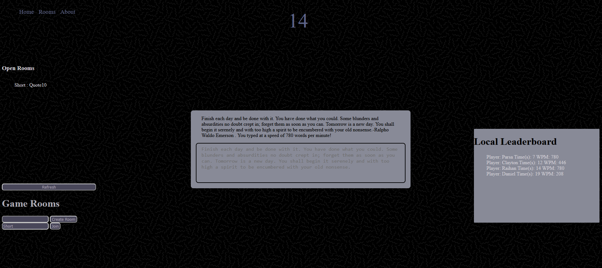
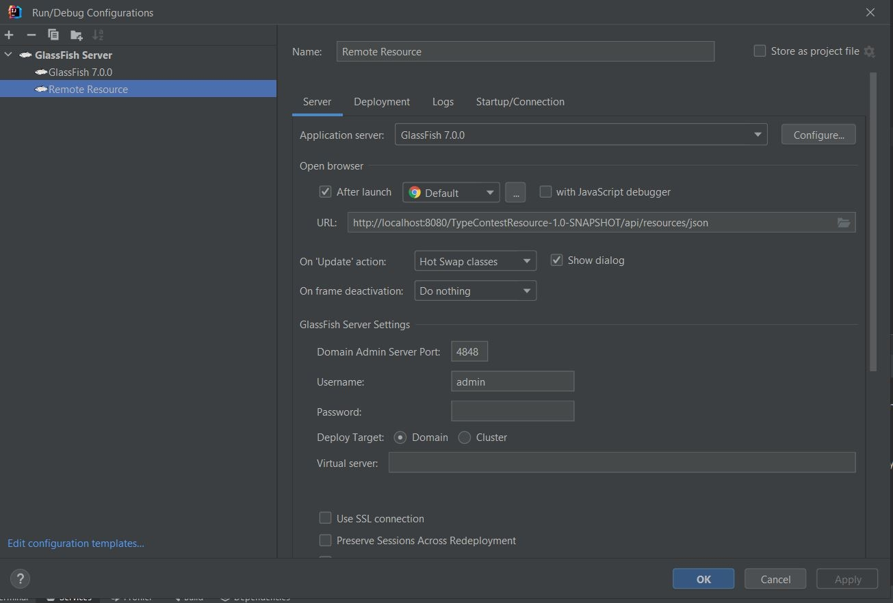

### Project Overview

TypeRacer.com is a real-time web-based typing game designed to bring players into a virtual room where they compete by typing a randomly generated text as fast as possible. The game tracks each player's typing speed in Words Per Minute (WPM) and displays a leaderboard at the end.

Real-time communication between players and the server is handled using WebSockets and REST APIs. The server manages game state, including the text to be typed, player scores, and the leaderboard. On the client side, JavaScript updates the user interface and interacts with the server to display real-time game results.

This project was adapted from [WebDevSimplified's JS-Speed-Typing-Game](https://github.com/WebDevSimplified/JS-Speed-Typing-Game).

&nbsp;

*Base website layout.*

&nbsp;

*Running website example.*

### How to Run

1. Clone this repository into your desired folder.

2. Open the project in IntelliJ IDEA with administrator privileges.

3. Set up a configuration to launch a local GlassFish server with OpenJDK, and optionally, configure for a remote server.

4. Open and run any `.html` page via IntelliJ by selecting it as the current file (same dropdown as the GlassFish configuration) and hitting the 'play' button.

5. Navigate to the `index.html` file inside the `TypeRacerWebSocket` directory via the navigation bar.

6. Create a new room by entering a room code or join an existing room.

7. Once in a room, start typing the provided text as quickly and accurately as possible. The game only ends once the entire quote has been typed correctly.

8. After being prompted, enter your username. Your leaderboard position will be uploaded.

9. To play again, refresh the page or join a different room.

&nbsp;

*WebSocket configuration used to run the game.*

&nbsp;

*Resource API configuration used to run the game.*

### Resources

- [w3Schools](https://www.w3schools.com/): General CSS documentation
- [Coolors](https://coolors.co/eae8ff-d8d5db-adacb5-2d3142-b0d7ff): Color palette assistance
- [WebDevSimplified](https://github.com/WebDevSimplified/JS-Speed-Typing-Game): Helpful guide
- [WebToolkit](https://www.webtoolkit.eu/wt): Scrollbar manipulation resources
- [GoodReads](https://www.goodreads.com/quotes?page=1): Source of quotes
- [Background Image](https://www.toptal.com/designers/subtlepatterns/uploads/memphis-mini-dark.png): Background image used for the website
- [YouTube Video](https://youtu.be/P-CLCK5xBrI): Final project demo video

### Credits

This project was completed by:
- Parsa Zahraei Mohammadabady
- Clayton Cotter-Wasmund
- Daniel Baba
- Raihan Mosharrof
